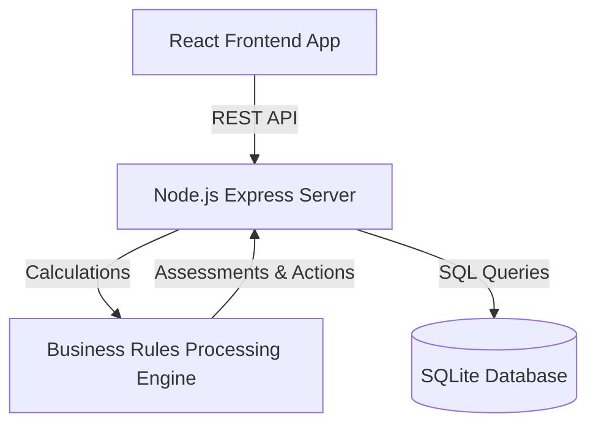

# Use Case Diagram & System Architecture
**Project**: Student Disciplinary Record & Counselling Log  
**Institution**: Sri Gowthami Educational Institutions  

---

## 1. System Architecture



---

## 2. Actors & System Use Cases

### Actors
1. **School Staff / Counsellors**: Core users who enter records, log sessions, update action plans, and track student status.
2. **School Administrators**: Manage, audit, edit, and archive records. Configure system guidelines.
3. **Management / Principal**: Read-only access to analytics reports, summaries, and high-level trends.

### Use Cases Diagram

```mermaid
left-to-right-direction
actor "School Staff" as Staff
actor "Administrator" as Admin
actor "Management" as Mgmt

rectangle "Student Disciplinary & Counselling Log" {
    usecase "Login & Authenticate" as UC1
    usecase "Submit Misconduct & Counselling Log" as UC2
    usecase "View Main Dashboard Grid" as UC3
    usecase "Filter & Search Student Records" as UC4
    usecase "View Student Case Detail & Audit Log" as UC5
    usecase "Update Disciplinary Case (CRUD)" as UC6
    usecase "Recalculate Behavioral Risk & Recommendations" as UC7
    usecase "Update Case Status (Active/Completed/Archived)" as UC8
    usecase "View Analytics Charts & Performance Trends" as UC9
    usecase "Export Data Reports (CSV)" as UC10
}

Staff --> UC1
Staff --> UC2
Staff --> UC3
Staff --> UC4
Staff --> UC5
Staff --> UC7

Admin --> UC1
Admin --> UC3
Admin --> UC5
Admin --> UC6
Admin --> UC8
Admin --> UC10

Mgmt --> UC1
Mgmt --> UC3
Mgmt --> UC9
Mgmt --> UC10

UC2 .-> UC7 : <<include>>
UC6 .-> UC7 : <<include>>
UC8 .-> UC5 : <<include>>
```
